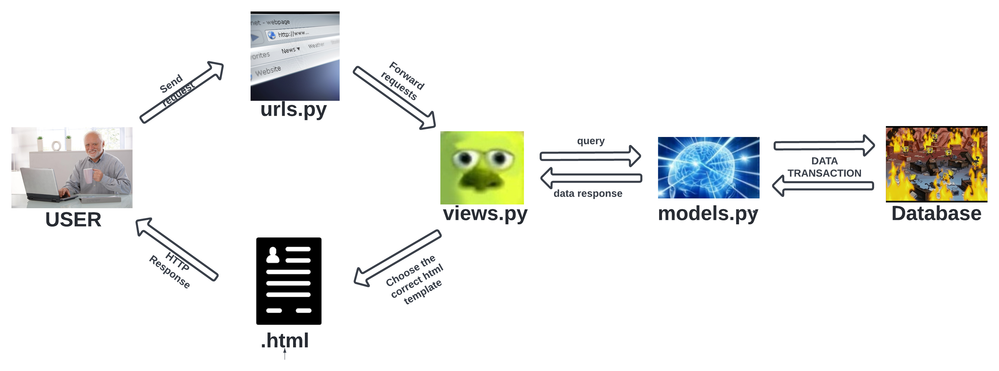

# Tugas 2 PBP Gasal 2022
## 1. Bagan request client ke web aplikasi berbasis Django dan kaitannya urls.py, views.py, models.py, dan html

## 2. Alasan membutuhkan Virtual Environment
Alasan kita perlu menggunakan virtual environment adalah agar kita dapat mengisolasi package dan dependencies aplikasi yang sedang kita kembangkan. Pengisolasian ini memastikan package dan dependencies yang dipakai pada pengembangan proyek tersebut tidak bertabarakan dengan versi lainnya yang ada dalam komputer tempat pengerjaan proyek tersebut. Dalam virtual environment, package dan dependencies yang kita pakai dalam proyek tersebut hanya akan berlaku dalam jangkauan proyek tersebut (virtual environment).
## 3. Cara saya mengimplementasikan poin 1 sampai dengan 4
### Poin 1: memmbuat fungsi pada views.py 
from django.shortcuts import render
```
# TODO: Create your views here.

from katalog.models import CatalogItem

def show_catalog(request):
    catalogs = CatalogItem.objects.all()
    context = {
        'list_catalog': catalogs ,
        'name' : 'Roy Maruli Tua Nababan',
        'id' : '2106750521'
    }
    return render(request, 'katalog.html', context)
```
Yang pertama saya perlu lakukan agar saya dapat melakukan pengambilan dari model adalah meng-import CatalogItem dari file models.py agar kita dapat menggunakannya. CatalogItem merupakan class yang merepresentasikan barang-barang yang ada dalam katalog. Class CatalogItem memiliki atribut dari tiap barang yang ingin kita tampilkan kepada user. Setelah itu, saya membuat suatu function bernama 'show_catalog' yang akan digunakan untuk menampilkan data kita ke dalam template (katalog.html) dengan memanfaatkan function render. Dalam function ini, saya membuat suatu list yang berisi semua object dari CatalogItem serta menambahkan variable yang menyimpannya serta name dan id saya. Variabel dalam dict bernama context ini akan di-pass menggunakan render.

```
<h5>Name: </h5>
  <p>{{name}}</p>

  <h5>Student ID: </h5>
  <p>{{id}}</p>

  <table>
    <tr>
      <th>Item Name</th>
      <th>Item Price</th>
      <th>Item Stock</th>
      <th>Rating</th>
      <th>Description</th>
      <th>Item URL</th>
    </tr>
     Add the data below this line 
    
      <tr>
          <th>{{catalog.item_name}}</th>
          <th>{{catalog.item_price}}</th>
          <th>{{catalog.item_stock}}</th>
          <th>{{catalog.rating}}</th>
          <th>{{catalog.description}}</th>
          <th>{{catalog.item_url}}</th>
      </tr>
    
  </table>
```
Setelah itu, saya  melakukan pemetaan data yang didapatkan dari function show_catalog (dari views.py) ke dalam ke file katalog.html sesuai dengan kebutuhan.

### Poin 2: melakukan routing
```
# TODO: Implement Routings Here
from django.urls import path
from katalog.views import show_catalog

app_name = 'katalog'

urlpatterns = [
    path('', show_catalog, name='show_catalog'),
]
```
Untuk melakukan routing, pertama-tama saya perlu mengubah file urls.py yang berada di folder 'katalog'. Saya meng-import function 'show_catalog' dan mengisi parameter urlpatterns saat url '' pada path 'katalog' dengan function tersebut. 
```
urlpatterns = [
    path('admin/', admin.site.urls),
    path('', include('example_app.urls')),
    path('katalog/',include('katalog.urls'))
]
```
Saya pun juga menambahkan path saat 'katalog/' pada file urls.py yang berada di django_projects agar menambah cara mengakses katalog yang telah dibuat lewat urls.

Setelah itu saya melakukan migration dan menjalankan loaddata untuk menggunakan data yang telah di-tulis pada file .json di katalog\fixtures .

### Poin 3: Melakukan deployment ke heroku
Saya membuka laman Heroku dan membuat aplikasi. Lalu saya mendaftarkan HEROKU_API_KEY dan HEROKU_APP_NAME yang disimpan pada github secret. 