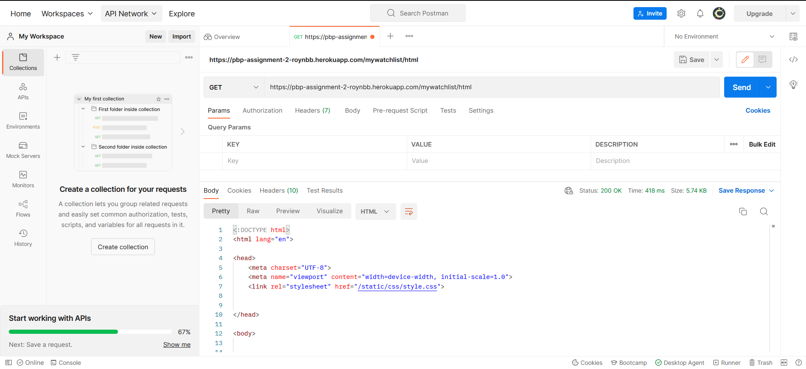
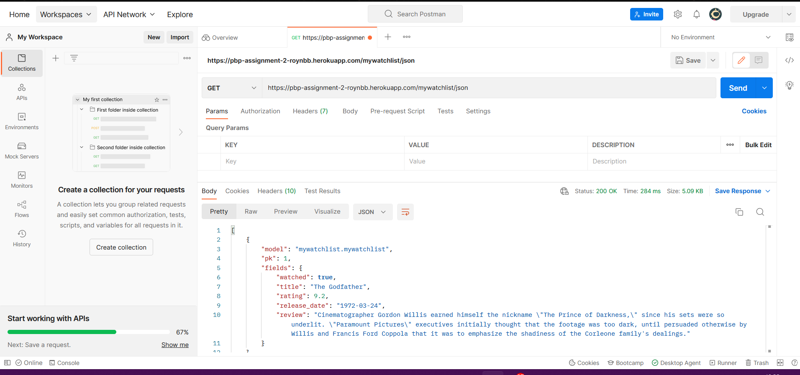
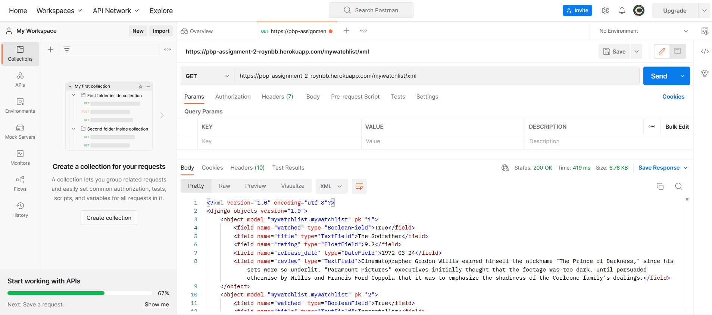

# Link Deployment HEROKU app
https://pbp-assignment-2-roynbb.herokuapp.com/mywatchlist/
# Tugas 3 Pertanyaan  PBP Gasal 2022
## 1. Perbedaan antara JSON, XML, dan HTML
JSON dan XML merupakan format yang digunakan untuk menyimpan,membaca, dan menukar informasi dari web server agar dapat dilihat oleh pengguna.
Walaupun keduanya memiliki fungsi yang sama, mereka memiliki beberapa perbedaan yaitu:\
<ul> 
    <li>JSON menyimpan elemennya secara efisien tetapi tidak nyaman dilihat mata manusia. Sedangkan XML kebalikannya</li>
    <li>JSON memang digunakan untuk mengirimkan data dengan diurai dan dikirim lewat internet. Sedangkan XML memiliki kegunaan tambahan sebagai catatan.</li>
</ul>
HTML (Hypertext Markup Language) adalah bahasa yang digunakan untuk tampilan halaman website atau bisa disebut "bahasa markup".HTML berfungsi untuk memungkinkan browser menampilkan teks, gambar, atau elemen lainnya.

## 2. Alasan perlunya data delivery dalam pengimplementasian sebuah platform
Saat mengimplementasikan sebuah platform, akan ada waktunya saat kita butuh untuk mengirimkan data daru satu stack ke stack lainnya, data delivery memungkinkan kita untuk melakukan hal tersebut. Seperti yang telah dijawab pada pertanyaan pertama, ada beberapa contoh format yang dapat kita gunakan untuk hal ini, yaitu HTML, JSON, dan XML.

## 3. Cara saya mengimplementasikan tiap checklist yang ada
### 1. Membuat aplikasi mywatchlist 
Pertama-tama yang perlu saya lakukan adalah menyalakan virtual environment. Setelah itu saya menjalankan perintah "python manage.py startapp wishlist" dan menambahkan 'mywatchlist' ke dalam INSTALLED_APPS di project_django/settings.py.
Lalu saya pun juga membuat function show_watchlist di dalam mywatchlist/views.py
### 2. Menambahkan path mywatchlist
Menambahkan path ke apps watchlist pada file urls.py
```
    ...
    path('katalog/',include('katalog.urls'))
    path('', show_watchlist, name='show_watchlist')
]
```
Setelah itu saya juga membuat file urls.py dalam file 'mywatchlist', lalu menambah path dalam file tersebut.
```
from django.urls import path

from mywatchlist.views import show_watchlist
app_name = 'mywatchlist'

urlpatterns = [
    path('', show_watchlist, name='show_watchlist')
]
```
### 3. Membuat sebuah model bernama MyWatchList beserta atributnya
Membuat model tersebut dalam mywatchlist/models.py
```
...
class MyWatchList(models.Model):
    watched = models.BooleanField()
    title = models.TextField()
    rating = models.FloatField()
    release_date = models.DateField()
    review = models.TextField()
```
Serta membuat suatu function dalam mywatchlist/views.py yang dapat memberikan data yang ada ke template. 
```
...
data = MyWatchList.objects.all()
def show_watchlist(request):
    context = {
        'list_movies': data ,
        'name' : 'Roy Maruli Tua Nababan',
        'id' : '2106750521',
        'watch_prompt' : watch_prompt
    }
    return render(request, 'watchlist.html', context)
```

### 4. Menambahkan data untuk objek MyWatchList
Membuat folder fixtures dalam mywatchlist dan membuat file json bernama 'initial_watchlist_data.json' didalamnya. Lalu saya memasukkan data-data daftar film yang ingin ditonton beserta atributnya pada file json seperti berikut:
```
[
    {
        "model": "mywatchlist.mywatchlist",
        "pk": 1,
        "fields": {
            "watched": true,
            "title": "The Godfather",
            "rating": 9.2,
            "release_date": "1972-03-24",
            "review": "Cinematographer Gordon Willis earned himself the nickname \"The Prince of Darkness,\" since his sets were so underlit. \"Paramount Pictures\" executives initially thought that the footage was too dark, until persuaded otherwise by Willis and Francis Ford Coppola that it was to emphasize the shadiness of the Corleone family's dealings."
        }
    },
...
```
### 5. Membuat fitur yang dapat menyajikan data dalam tiga format
Membuat file bernama 'watchlist.html' dalam mywatchlist/templates. Di dalamnya, membuat template bagaimana data yang telah dimiliki dapat dilihat dalam tampilan html. 
### 6. Membuat routing agar tiga format data dapat diakses dalam urls yang diinginkan
Membuat dua function baru pada mywatchlist/views.py yang akan mengembalikan httpresponse yang sesuai dengan format data yang diinginkan
```
def show_xml(request):
    return HttpResponse(serializers.serialize("xml", data), content_type="application/xml")

def show_json(request):
    return HttpResponse(serializers.serialize("json", data), content_type="application/json")
```
Menambahkan path dalam mywatchlist/urls.py seperti berikut:
```
...
from mywatchlist.views import show_xml 
from mywatchlist.views import show_json 
app_name = 'mywatchlist'

urlpatterns = [
    path('', show_watchlist, name='show_watchlist'),
    path('xml/', show_xml, name='show_xml'),
    path('json/', show_json, name='show_json'),
    path('html/', show_watchlist, name='show_watchlist')
]
```
### 7. Melakukan deployment ke Heroku 
Mengubah isi Procfile menjadi berikut
```
release: sh -c 'python manage.py migrate && python manage.py loaddata initial_catalog_data.json && python manage.py migrate && python manage.py loaddata initial_watchlist_data.json'
web: gunicorn project_django.wsgi --log-file -
```
karena kita membuat aplikasi ini dalam git repo yang pernah dihubungkan kepada satu app heroku.

# Bukti lolos postman testing


